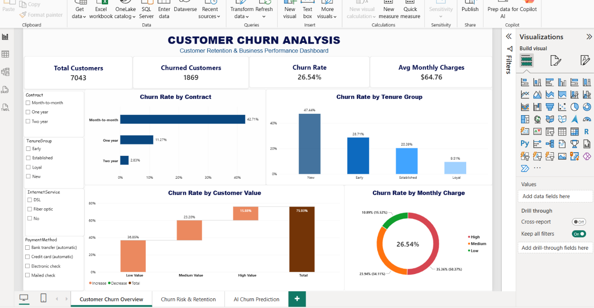
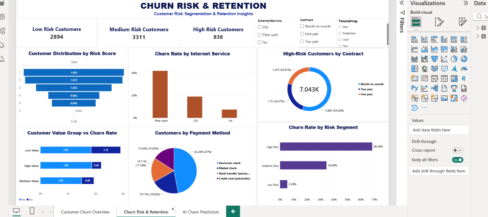
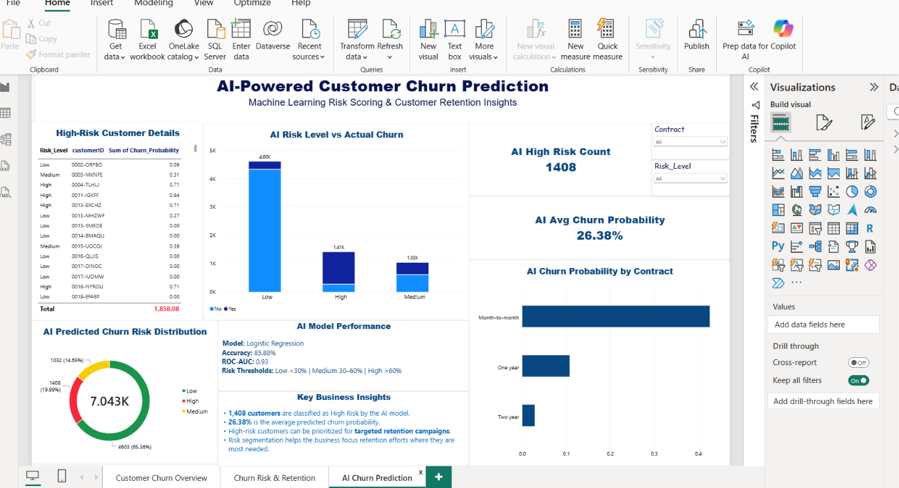

# AI Telco Customer Churn Analysis

An AI-powered customer churn analysis project combining **Python, Machine Learning, automated prediction, and Power BI** to identify customer churn patterns and prioritize customers at higher risk of churn.

## 📌 Project Overview

This project analyzes Telco customer data to understand the key factors associated with customer churn and uses Machine Learning to generate customer-level churn risk predictions.

The project combines:

* Python for data cleaning and feature engineering
* Exploratory and business analysis
* Machine Learning for churn prediction
* Automated customer risk prediction
* Power BI for interactive business reporting
* AI-based customer risk segmentation

## 🎯 Business Problem

Customer churn can negatively impact revenue and customer retention.

The objective of this project is to:

* Identify important customer churn patterns
* Predict customer churn probability
* Segment customers into Low, Medium, and High Risk
* Identify customers requiring retention attention
* Provide actionable insights through Power BI

## 🛠️ Tools & Technologies

* Python
* Pandas
* NumPy
* Scikit-learn
* Joblib
* Excel
* Power BI
* DAX
* Machine Learning
* Logistic Regression
* Random Forest

## 🔄 Project Workflow

```text
Raw Customer Data
        ↓
Data Cleaning
        ↓
Feature Engineering
        ↓
Exploratory & Business Analysis
        ↓
Machine Learning
        ↓
Model Comparison
        ↓
Random Forest Selection
        ↓
Churn Probability Prediction
        ↓
AI Risk Segmentation
        ↓
Automated Prediction Pipeline
        ↓
Power BI Dashboard
```

## 📊 Dataset

The dataset contains **7,043 customer records**.

Key information includes:

* Customer demographics
* Tenure
* Contract information
* Internet services
* Monthly charges
* Total charges
* Support tickets
* Services used
* Customer churn status

### Engineered Features

Additional features were created to support business and risk analysis:

* `TotalTickets`
* `TenureGroup`
* `MonthlyChargeGroup`
* `TotalServices`
* `CustomerValueGroup`
* `RiskScore`
* `ChurnRiskSegment`

## 🤖 Machine Learning

Two classification models were developed and compared:

1. Logistic Regression
2. Random Forest Classifier

### Model Performance

| Model               | Accuracy | Precision | Recall | F1 Score | ROC-AUC |
| ------------------- | -------: | --------: | -----: | -------: | ------: |
| Logistic Regression |   85.66% |    75.44% | 68.18% |   71.63% |  92.75% |
| Random Forest       |   84.88% |    69.03% | 78.07% |   73.27% |  91.34% |

Random Forest was selected for the prediction pipeline because the project places particular emphasis on identifying customers who may churn. It achieved higher **Recall (78.07%)** and **F1 Score (73.27%)** than Logistic Regression.

> Model selection is based on the project's defined evaluation criteria and should not be interpreted as evidence that the model will perform identically on future customer populations.

## 🧠 AI Risk Segmentation

The Random Forest model generates a **predicted churn probability for each customer**.

Risk levels are assigned using the following thresholds:

* **Low Risk:** Churn probability < 30%
* **Medium Risk:** 30%–59%
* **High Risk:** ≥ 60%

These risk segments are used in the Power BI dashboard to help identify customers with higher predicted churn probability.

## 📈 Power BI Dashboard

The Power BI dashboard contains three pages.

### Page 1 — Churn Overview

Provides an overall view of:

* Customer churn rate
* Churn by contract
* Churn by tenure
* Customer distribution
* Key churn patterns

### Page 2 — Customer & Churn Analysis

Focuses on:

* Customer segments
* Customer value
* Internet services
* Monthly charges
* Support tickets
* Churn patterns across customer groups

### Page 3 — AI-Powered Customer Churn Prediction

Provides:

* AI Risk Distribution
* AI High-Risk Customers
* Average Churn Probability
* AI Risk Level vs Actual Churn
* Churn Probability by Contract
* High-Risk Customer Details
* Random Forest Model Performance
* Key Business Insights

## ⚙️ Automation

An automated Python pipeline was created to generate customer-level churn predictions.

The pipeline:

1. Loads the processed customer dataset
2. Loads the trained Random Forest model
3. Generates churn predictions
4. Calculates churn probabilities
5. Assigns AI risk levels
6. Exports prediction results to Excel

Main automation script:

```text
Scripts/automated_pipeline.py
```

## 📁 Project Structure

```text
AI-Telco-Customer-Churn-Analysis/
│
├── data/
│   └── processed/
│       ├── customer_churn_final.xlsx
│       └── ai_churn_predictions_automated.xlsx
│
├── models/
│   └── churn_random_forest_model.pkl
│
├── Scripts/
│   └── automated_pipeline.py
│
├── powerbi/
│   └── AI_Telco_Customer_Churn_Dashboard.pbix
│
├── requirements.txt
└── README.md
```

## 💡 Key Business Insights

The analysis identified several notable churn patterns:

* Month-to-month customers showed substantially higher observed churn than customers on longer-term contracts.
* Customers with shorter tenure showed higher observed churn than established customers.
* Higher monthly charge groups showed higher observed churn.
* Customers with higher numbers of support tickets showed elevated observed churn in the analyzed dataset.
* The AI risk segmentation provides a customer-level view that can be used to prioritize retention analysis.

These findings describe patterns observed in the analyzed dataset and do not by themselves establish causation.

## 🚀 Project Outcome

This project demonstrates an end-to-end **AI Data Analyst workflow**:

**Data → Analysis → Machine Learning → Prediction → Risk Segmentation → Automation → Business Dashboard**

It combines technical data analysis with business-focused reporting to support customer retention analysis.
## 📸 Dashboard Preview

### Page 1 — Customer Churn Overview



### Page 2 — Customer Risk & Retention



### Page 3 — AI-Powered Customer Churn Prediction


